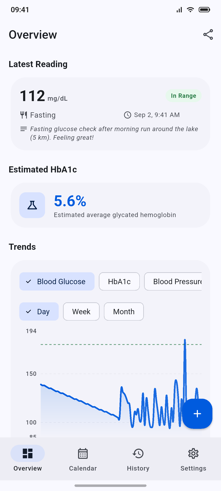
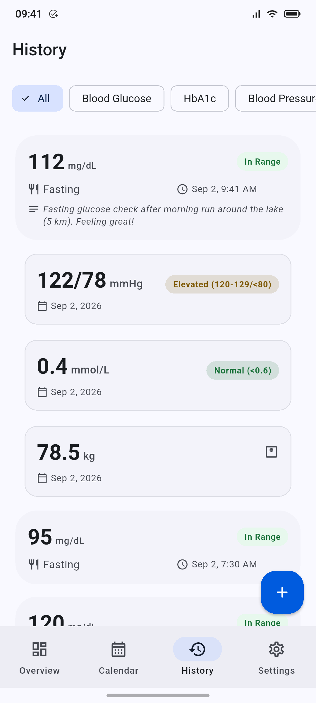
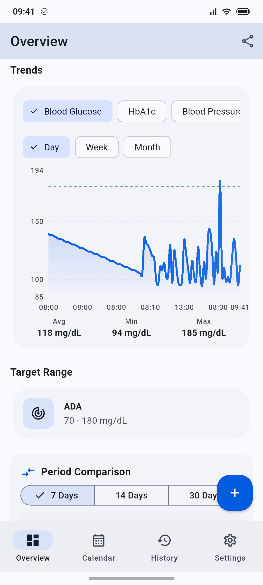
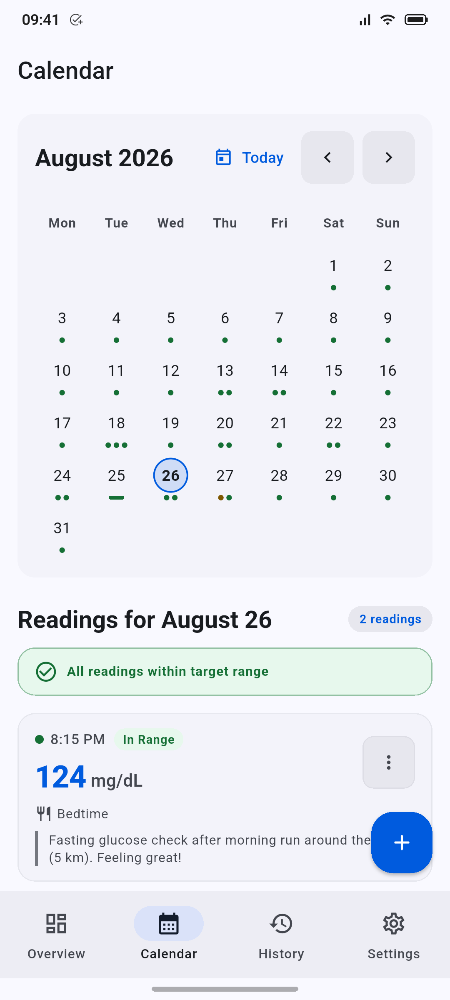
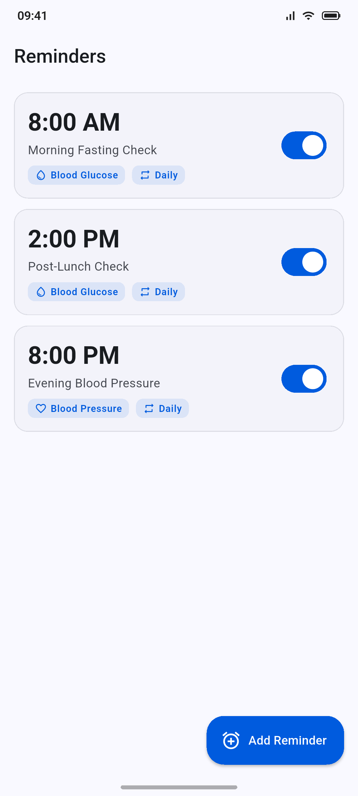
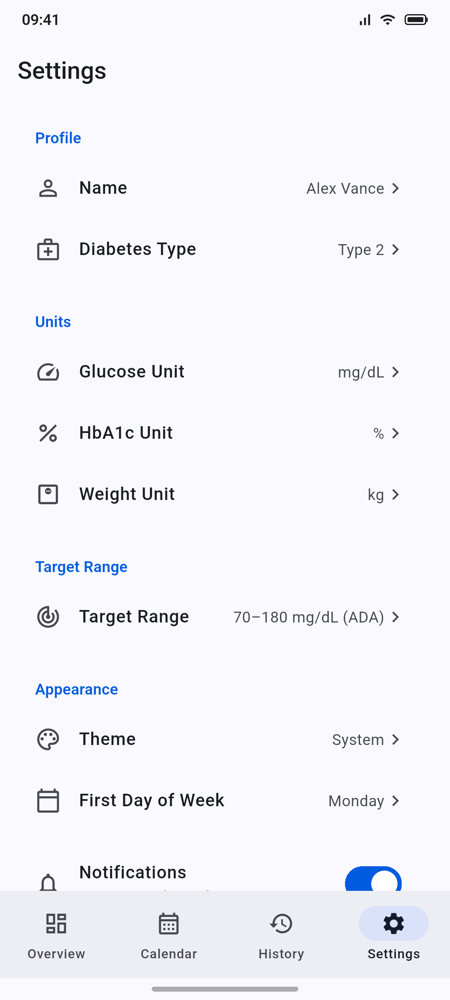

# 🩸 Glucosa — Modern Diabetes & Metabolic Health Platform

[](https://github.com/piotrekert90/flutter_glucosa/actions/workflows/ci.yml)
[](CHANGELOG.md)
[](https://flutter.dev)
[](https://dart.dev)
[](https://riverpod.dev)
[](https://isar-community.dev)
[](https://pub.dev/packages/go_router)
[](LICENSE)

> **Local-first metabolic health tracking built with Flutter, Riverpod, and on-device storage.**

**Glucosa** is an offline-first diabetes and metabolic health tracking application built with **Flutter**, **Riverpod 3.x**, **Isar Community**, and **Material 3**. Designed for individuals managing diabetes (Type 1, Type 2, Gestational, LADA), Glucosa provides multi-metric tracking, trend analysis, clinical calculators, recurring reminders, calendar overview, device health integrations, and CSV data export/import.

## 📸 Screenshots

| Overview | History | Statistics |
|:---:|:---:|:---:|
|  |  |  |

| Calendar | Reminders | Settings |
|:---:|:---:|:---:|
|  |  |  |

---

## 🏛️ Architecture & Design Principles

The technical design focuses on clinical reliability and data privacy:

- **Local-first storage** — Health data remains on-device in an Isar database unless you explicitly export or sync it through a platform integration.
- **Data portability** — With Android cloud backup explicitly disabled (`allowBackup="false"`), complete CSV export and import serve as the primary path for backups and migration.
- **Biometric security** — Optional app lock using device biometrics (Face ID, Touch ID, Fingerprint) or system PIN.
- **Operational diagnostics** — Crash and usage telemetry may be sent to Firebase for reliability and debugging, while raw health readings stay on-device by default.

| Dimension | Implementation |
|---|---|
| **State Management** | **Riverpod 3.x** code generation (`@riverpod`), stream-driven notifiers, and automatic provider disposal |
| **Clinical Domain** | Value objects, ADA / AACE / UK NICE clinical guidelines, AHA blood pressure stages (Normal, Elevated, High, Crisis), and ketone risk stratification |
| **Reactive State** | Unified multi-metric aggregation (glucose, HbA1c, blood pressure, cholesterol, ketones, weight) |
| **Data Visualization** | Interactive time-series charts via `fl_chart`, day/week/month bucketing, and dynamic target range boundary lines |
| **Data Privacy** | Local-first persistence, biometric app lock, explicit export/sync control, and limited Firebase diagnostics for app reliability |
| **Clean Architecture** | Feature-first modular package structure, strict inward dependency rules, and domain layer isolated from UI and database |

---

## 🎯 Core Features

### 📊 Multi-Metric Health Tracking
- **Blood Glucose**: Log readings with rich clinical meal context (Fasting, Before/After Breakfast, Before/After Lunch, Before/After Dinner, Snack, Bedtime, Night, Recheck, Other). Automatic conversion and display in **mg/dL** or **mmol/L**.
- **HbA1c**: Record laboratory glycated hemoglobin in **%** or **mmol/mol**.
- **Blood Pressure**: Monitor systolic and diastolic pressures (mmHg) with clinical status indicators (Normal, Elevated, High, Crisis).
- **Ketones**: Track blood beta-hydroxybutyrate levels (mmol/L) with clinical warnings (Normal, Elevated, High).
- **Cholesterol**: Record Total, LDL, and HDL lipid profiles (mg/dL).
- **Weight**: Track body weight in **kg** or **lbs**.

### 📈 Interactive Charts & Clinical Insights
- **Trend Charts**: Interactive `fl_chart` time-series visualization with flexible aggregation (**Day**, **Week**, **Month**).
- **Target Range Bounds**: Visual upper and lower target lines on charts based on personalized target ranges.
- **Estimated HbA1c (eA1c)**: Calculated dynamically using the ADAG formula based on a 90-day glucose reading average (minimum 3 readings).
- **Unified History Feed**: Chronological stream of all health metrics with filter chips, swipe-to-delete, and instant undo actions.
- **Interactive Calendar**: Monthly calendar overview with day-level inspection, month navigation, and quick entry shortcuts.
- **Habits & Milestones**: Habit tracking, logging streaks, milestone badges, and clinical visit summaries.

### 🛠 Tools & Platform Integrations
- **HbA1c Calculator**: Standalone utility screen offering bidirectional estimation between average glucose and HbA1c with direct reading persistence.
- **Scheduled Reminders**: Local notification reminders for medication, blood glucose checks, and lifestyle logging with customizable recurring schedules. On Android, reminders use inexact scheduling by default (an exact alarm is used only when the system permits it), so delivery can slip by a few minutes under battery optimization.
- **Health Platform Sync**: Native integration with **Apple HealthKit** (iOS) and **Google Health Connect** (Android) for syncing blood glucose, blood pressure, ketones, and weight.
- **Biometric Security**: App lock protection supported by biometric authentication (Face ID, Touch ID, Fingerprint) or system PIN with configurable auto-lock timeout.
- **Home Screen Widgets**: Quick-glance glucose monitoring supported via Android AppWidgets.
- **CSV Data Export**: Filter readings by metric and date range, generating standard CSV files shareable directly via the native system share sheet.

### ⚙️ Personalization & Clinical Settings
- **Target Range Profiles**: Select clinical presets (**ADA**, **AACE**, **UK NICE**) or configure custom minimum/maximum glucose thresholds.
- **Diabetes Profiles**: Tailored tracking for **Type 1**, **Type 2**, **Gestational**, and **LADA**.
- **Appearance**: Seamless switching between System, Light, and Dark themes with Material 3 styling.

---

## 🏗 Architecture & Engineering

Glucosa follows **Clean Architecture** organized with a **feature-first** package structure:

```text
lib/
├── main.dart                    # Application entry point & crash reporting
├── app.dart                     # MaterialApp.router configuration & theme bindings
├── core/
│   ├── config/                  # Environment flags & runtime configuration
│   ├── domain/                  # Shared value objects, clinical validators & converters
│   ├── errors/                  # Unified Failure hierarchy & Result types
│   ├── integrations/            # Biometrics (local_auth) & Health sync (HealthKit / Health Connect)
│   ├── presentation/
│   │   ├── navigation/          # AdaptiveNavigationScaffold (Bottom Bar vs Navigation Rail)
│   │   ├── theme/               # Semantic color tokens, typography & feedback themes
│   │   └── widgets/             # Reusable UI primitives (empty, loading, error, charts)
│   ├── providers/               # Global Isar instance & Riverpod observers
│   ├── router/                  # GoRouter routes and redirection logic
│   └── utils/                   # AppLogger, crash reporter, date & format helpers
└── features/
    ├── blood_pressure/          # Blood pressure domain, Isar models & screens
    ├── calendar/                # Monthly & daily calendar view of readings
    ├── cholesterol/             # Lipid panel tracking
    ├── export/                  # CSV compilation & native share service
    ├── glucose/                 # Glucose domain, statistics & entry forms
    ├── hba1c/                   # HbA1c readings & clinical calculator
    ├── history/                 # Merged chronological timeline & filtering
    ├── ketones/                 # Blood ketone tracking
    ├── onboarding/              # First-launch clinical setup wizard
    ├── overview/                # Dashboard summary & trend charts
    ├── reminders/               # Scheduled measurement alerts & notification service
    ├── settings/                # Profile, unit preferences, target ranges & app lock
    ├── statistics/              # Milestone gallery, habits & progress summaries
    └── weight/                  # Body weight tracking
```

### Key Technical Stack
- **State Management**: [Riverpod 3.x](https://riverpod.dev) with code generation (`@riverpod`). Providers bind directly to reactive streams.
- **Database**: [Isar Community](https://isar-community.dev) fast NoSQL database with reactive watch queries.
- **Routing**: [GoRouter](https://pub.dev/packages/go_router) declarative navigation.
- **Charts**: [fl_chart](https://pub.dev/packages/fl_chart) smooth, reactive line charts.
- **Health Platform**: [health](https://pub.dev/packages/health) for Apple HealthKit & Health Connect integration.
- **Home Widgets**: [home_widget](https://pub.dev/packages/home_widget) for Android AppWidget support.
- **Biometrics**: [local_auth](https://pub.dev/packages/local_auth) for biometric authentication and app lock.
- **Localization**: Native Flutter `intl` & `l10n` supporting 10 languages: English (`en`), German (`de`), Spanish (`es`), French (`fr`), Italian (`it`), Japanese (`ja`), Korean (`ko`), Dutch (`nl`), Polish (`pl`), and Portuguese (`pt`).
- **Testing**: Comprehensive test suite (840+ tests) covering domain logic, state transitions, repository contracts, and presentation widgets.

---

## 🚀 Getting Started

### Prerequisites
- Flutter SDK `3.47+`
- Dart SDK `3.12+`

### Setup Commands

```bash
# Clone the repository
git clone https://github.com/piotrekert90/flutter_glucosa.git
cd flutter_glucosa

# Install dependencies
flutter pub get

# Generate localization files
flutter gen-l10n

# Generate Riverpod & Isar code
dart run build_runner build --delete-conflicting-outputs

# Launch application
flutter run
```

### 📱 Platform Setup Notes

- **Android**: Supports Google Health Connect, notification scheduling, and Home Screen AppWidgets out of the box.
- **iOS**: Apple HealthKit entitlements, App Group (`group.com.ekerstudio.glucosa`), and `PrivacyInfo.xcprivacy` are configured.

---

## 🧪 Verification & Quality Assurance

Glucosa enforces a mandatory verification pipeline:

```bash
# Format code
dart format lib test

# Run static analysis
flutter analyze

# Execute Riverpod-specific linter rules
dart run custom_lint

# Run test suite
flutter test --exclude-tags "golden,screenshot"
```

---

## 🤖 Development Standards & Workflow

The codebase follows conventions defined in `AGENTS.md` and `agents_project.md`:

- **Layer Isolation**: Universal standards in `AGENTS.md` maintain clean architectural layer boundaries and explicit resource disposal.
- **Mandatory Verification Pipeline**: Every change is validated through automated static analysis, `custom_lint` rules, formatting, and unit/widget test suites.
- **Pure Domain Boundaries**: The core domain layer contains zero UI, Flutter, or database dependencies, ensuring clinical logic (ADA thresholds, ADAG formulas, unit converters) remains portable and testable.

---

## ⚕️ Medical Disclaimer & Clinical Citations

> [!WARNING]
> **Not a Medical Device / Not Medical Advice**  
> Glucosa is designed strictly as a personal health logging tool and informational reference for individuals tracking diabetes metrics. Glucosa is **not a certified medical device** (under EU MDR 2017/745, US FDA, or equivalent regulatory frameworks) and does not provide automated diagnostic conclusions, insulin dosing calculations, or clinical treatment plans. Always consult a qualified physician or endocrinologist before making adjustments to medication, diet, or treatment regimens.

### Clinical Formulas & Guidelines
- **Estimated HbA1c (eA1c):** Calculated using the clinically validated A1c-Derived Average Glucose (ADAG) study formula:
  $$\text{eA1c } [\%] = \frac{\text{Average Glucose } [\text{mg/dL}] + 46.7}{28.7}$$
  *Citation:* Nathan DM, Kuenen J, Borg R, Zheng H, Schoenfeld D, Heine RJ. *Translating the A1C assay into estimated average glucose values.* Diabetes Care. 2008;31(8):1473-1478. [doi:10.2337/dc08-0545](https://doi.org/10.2337/dc08-0545).
- **Target Range Standards:** Threshold guidelines reference standards published by the American Diabetes Association (ADA *Standards of Care in Diabetes*), the American Association of Clinical Endocrinologists (AACE), and the UK National Institute for Health and Care Excellence (NICE NG17/NG18/NG28).

---

## 📜 License & Privacy

- **License:** Glucosa is open-source software licensed under the [MIT License](LICENSE).
- **Privacy Policy:** Read our complete [Privacy Policy](doc/privacy_policy.md) disclosing HealthKit, Health Connect, widget data, and local-first data processing.

